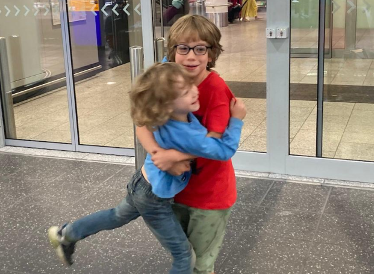

&nbsp;

##  Spiele mit meinem Bruder André

<!--

-->

        

- [Link öffnen](https://github.com/viktor-chiarcos/viktor-chiarcos.github.io/blob/main/_pages/Spiele/Ich-Spiele-mit-Andre-Zusammen.md)
