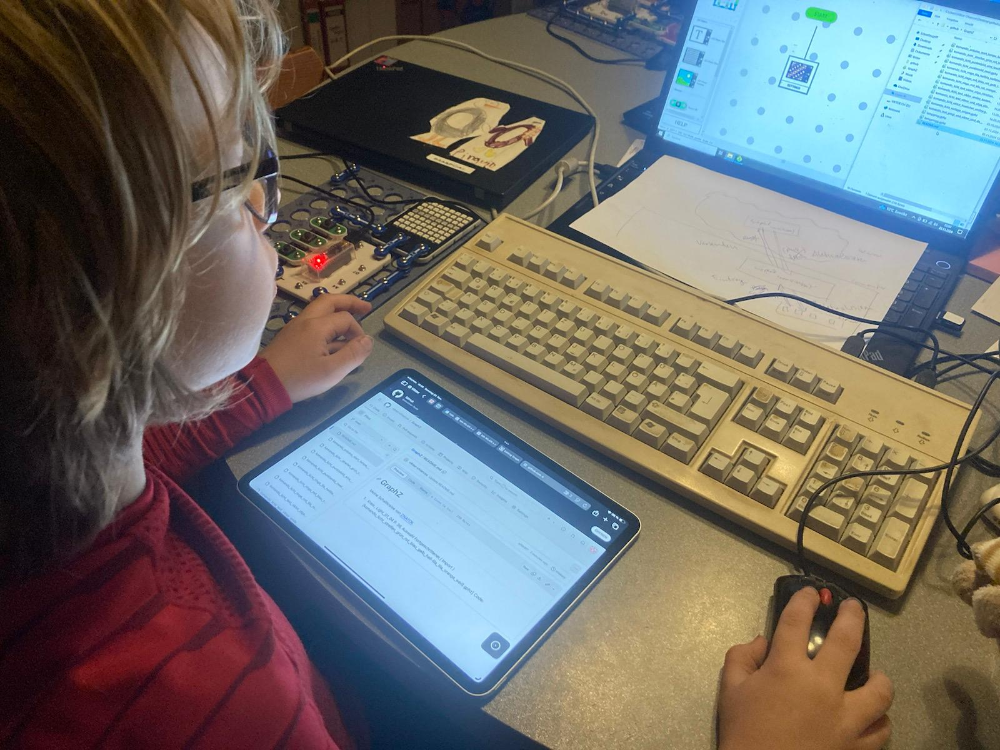

Ich interessiere mich für Technik.\
Du auch? [Dann tritt bei unserer Organisation bei](/tech/organisation/).

- Mit [ZNATOK](https://znatok.ru) baue ich Schaltkreise und programmiere sie mit [GraphZ](https://znatok.ru/files/arduino_mobile/Znatok-Arduino-Mobile-Graph-Z-Manual-Rus_1.pdf)
- Mit meinem Raspberry Pi 5 erkunde ich Linux 

	

<!--

-->
# Wiki

# ics Dateien

<a id="wiki/ics">

Eine ics Datei ist für ein Kalendereintrag gedacht.

## Wie erstelle ich eine ics-Datei?

### Methode 1: Über [kurzlinks.de](https://kurzlinks.de)

#### Schritt 1: Webseite öffnen

Öffne nun die Webseite [kurzlinks.de/qrcode#ical](https://kurzlinks.de/qrcode#ical)

#### Schritt 2: Daten eingeben

Gib nun Daten ein.\
**Achte darauf:** Die Felder Titel, Beginn und Ende sind verpflichtend auszufüllen. Alle anderen Angaben sind optional

Speichere deine Datei. Dann bist du fertig.

### Methode 2: Datei mit Vorlage erstellen **[empfohlen]**

#### Schritt 1: Datei erstellen

Erstelle **an einem beliebigen Ort** eine *Datei* mit der Endung *.ics*

#### Schritt 2: Vorlage einfügen und bearbeiten

Öffne deine Datei mit deinem *Texteditor*.\

Füge folgenden Inhalt ein:

    BEGIN:VCALENDAR
    VERSION:2.0
    CALSCALE:GREGORIAN
    METHOD:PUBLISH
    BEGIN:VEVENT
    SUMMARY:Mein Name fürs Event 
    DESCRIPTION:Meine Beschreibung fürs Event
    LOCATION:Mein Ort fürs Event
    DTSTART:20260222T200000Z
    DTEND:20260222T235900Z
    DTSTAMP:20260222T161928Z
    COMMENT:Mein Kommentar fürs Event
    END:VEVENT
    END:VCALENDAR

So gebe ich die Zeit an: 

**Start**

    DTEND: <Dein Jahr><Dein Monat><Dein Tag>T<Zeit (Stunde)><Zeit (Minute)><Zeit (Sekunde)>Z

**Ein Beispiel**

    DTENDT:20260222T200000Z

**Ende**

    DTSTART: <Dein Jahr><Dein Monat><Dein Tag>T<Zeit (Stunde)><Zeit (Minute)><Zeit (Sekunde)>Z

**Ein Beispiel**

    DTSTART:20260222T200000Z

**Sonst Titel/Kommentar/Beschreibungstext wie ich schreiben**

# Linux Terminal 

## Wie kann ich ein Verzeichnis  öffnen?

- Beim Start von einem neuem Fenster ist der Ordner `home` offen
- Wir gehen zum Beispiel in das Verzeichnis `videos`
	- Um in Das Verzeichnis `videos` zu öffnen sagen sie
	
			$> cd Videos

	- Der Computer sagt

			chiarcos_viktor@Linux-Viktor:~/Videos $>

- Sie können nun auch raus aus dem Verzeichnis mit 

		$> cd ..

- Um ein neues Verzeichnis zu öffnen machen sie genau das gleiche
- wenn sie ein weiteres Verzeichnis öffnen wollen dann sagen sie:

		$> cd videos/Ordner Name

- **Ende**

&nbsp;

## Was bedeutet der Befehl `sudo`?

- `sudo` ist ein Befehl, um Administratorrechte zu aktivieren
- `sudo` benötigst Du, um Daten im System zu verstellen
- Benutzer, die keine Administratorrechte haben, können `sudo` nicht verwenden
- Mit `sudo` kannst du: Apps installieren, Herrunterfahren, Zugrifsrechte von anderen Personen Verwenden, Benutzer Hinzufügen und vieles mehr
- Zum Beispiel:
    chiarcos_viktor@Linux-Viktor:~ $ sudo adduser neue-person-1

&nbsp;

# Wie kann ich einen Benutzer Hinzufügen?

- Wenn du einen Benutzer hinzufügen willst soltest du dir einen Nutzernamen überlegen
- Dannach gibst du den Befehl ein:

    	chiarcos_viktor@Linux-Viktor:~ $ adduser neue-person-1

- adduser gibt eine Rückmeldung:

    	adduser: Nur root darf Benutzer oder Gruppen zum System hinzufügen.

- Wir haben gelernt wofür man sudo braucht.
- bevor sie adduser schreiben setzen sie sudo.
- nächster versuch:
    
    	chiarcos_viktor@Linux-Viktor:~ $ sudo adduser neue_person_eins

- Also es geht:
    
    	Lege Benutzer »neue_person_eins« an ...
		Lege neue Gruppe »neue_person_eins« (1003) an ...
		Lege neuen Benutzer »neue_person_eins« (1003) mit Gruppe »neue_person_eins« (1003) an ...
		Erstelle Home-Verzeichnis »/home/neue_person_eins« ...
		Kopiere Dateien aus »/etc/skel« ...
		Geben Sie ein neues Passwort ein:

	Zu ihrer Sicherheit Wird die Passworteingabe nicht angezeigt

- Wenn sie das Passwort eingegeben haben kommt diese Rückmeldung:

	     Vollständiger Name []:
	   	 Zimmernummer []:
	     Telefon geschäftlich []:
	     Telefon privat []:
	     Sonstiges []: 

- Dannach fragt er mich ob die Info korrekt ist:

	     Sind die Informationen korrekt? [J/n]

- Wenn Ja dann Drücken sie `<ENTER>`

- Wenn Nein dann schreiben sie `n`

  ***ENDE*** 

&nbsp;

# Backup

     sudo tar -cvzpf /media/wohnzimmer/FamilyBox/backup-viktor/linux-viktor/2026-01-25.tgz /usr/ /bin/ /home/ /root /etc /var /lib /Public /opt /sbin /snap /srv /sys

                     _________________________________________________________________     __________________________________________________________________________

## Unterstrichene Orte sollen ersetzt werden

**Strich 1:** Speicherort (tgz muss sein!)\
**Strich 2:** Pfade zum speichern (**EMPFOHLEN: /usr /home /sbin /sys /srv /var /lib /etc**)
## ZNATOK

- Meine [GraphZ](https://znatok.ru/link/?start-graphz))-Schaltkreise auf [GitHub](https://github.com/viktor-chiarcos/GraphZ)
- Check out my [ZNATOK programming shows](https://www.youtube.com/playlist?list=PLSWV8OnoemY7cPA46sp0pD5PcdmatZXrN)

<!-- mit automatischer skalierung -->

	

<!--

-->

<!-- 

-->

