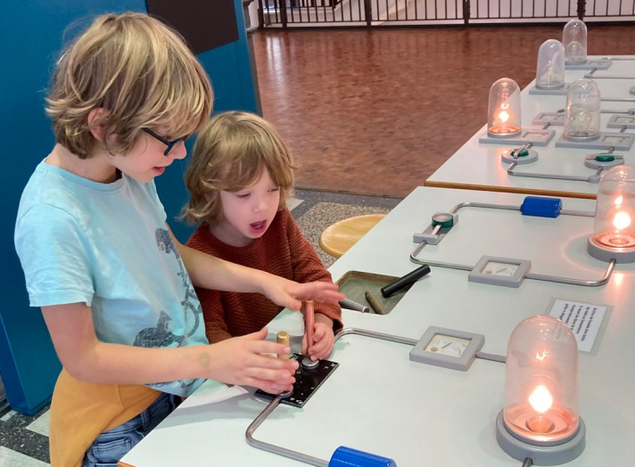
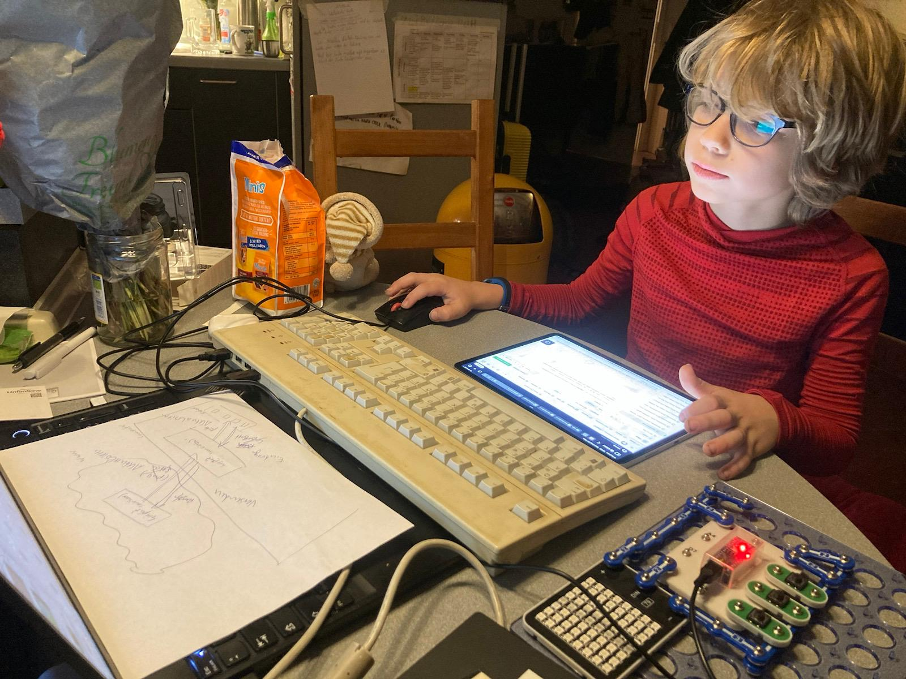

Ich interessiere mich für Technik. 

- Mit [ZNATOK](https://znatok.ru) baue ich Schaltkreise und programmiere sie mit [GraphZ](https://znatok.ru/files/arduino_mobile/Znatok-Arduino-Mobile-Graph-Z-Manual-Rus_1.pdf)
- Mit meinem Raspberry Pi 5 erkunde ich Linux 

# Linux Terminal 

## Wie kann ich ein Verzeichnis  öffnen?

- Beim Start von einem neuem Fenster ist der Ordner `home` offen
- Wir gehen zum Beispiel in das Verzeichnis `videos`
	- Um in Das Verzeichnis `videos` zu öffnen sagen sie
	
			$> cd Videos

	- Der Computer sagt

			chiarcos_viktor@Linux-Viktor:~/Videos $>

- Sie können nun auch raus aus dem Verzeichnis mit 

		$> cd ..

- Um ein neues Verzeichnis zu öffnen machen sie genau das gleiche
- wenn sie ein weiteres Verzeichnis öffnen wollen dann sagen sie:

		$> cd videos/Ordner Name

- **Ende**

&nbsp;

## Was bedeutet der Befehl `sudo`?

- `sudo` ist ein Befehl, um Administratorrechte zu aktivieren
- `sudo` benötigst Du, um Daten im System zu verstellen
- Benutzer, die keine Administratorrechte haben, können `sudo` nicht verwenden
- Mit `sudo` kannst du: Apps installieren, Herrunterfahren, Zugrifsrechte von anderen Personen Verwenden, Benutzer Hinzufügen und vieles mehr

&nbsp;

## ZNATOK

- Meine [GraphZ](https://znatok.ru/link/?start-graphz))-Schaltkreise auf [GitHub](https://github.com/viktor-chiarcos/GraphZ)
- Check out my [ZNATOK programming shows](https://www.youtube.com/playlist?list=PLSWV8OnoemY7cPA46sp0pD5PcdmatZXrN)

<!-- mit automatischer skalierung -->

<!--

-->

<!-- 

-->