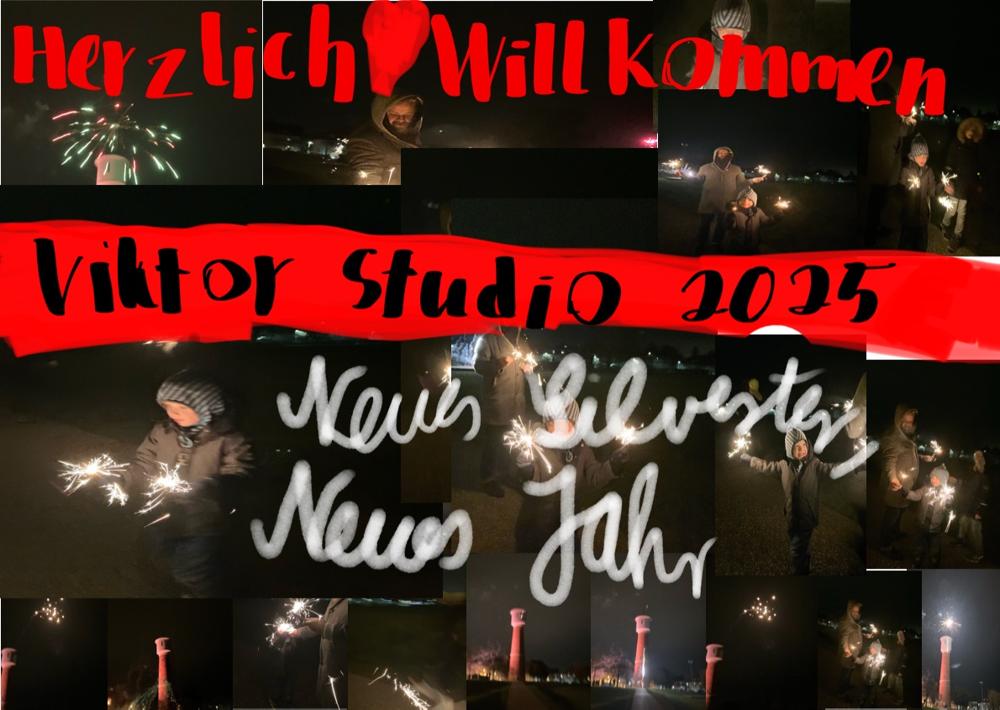
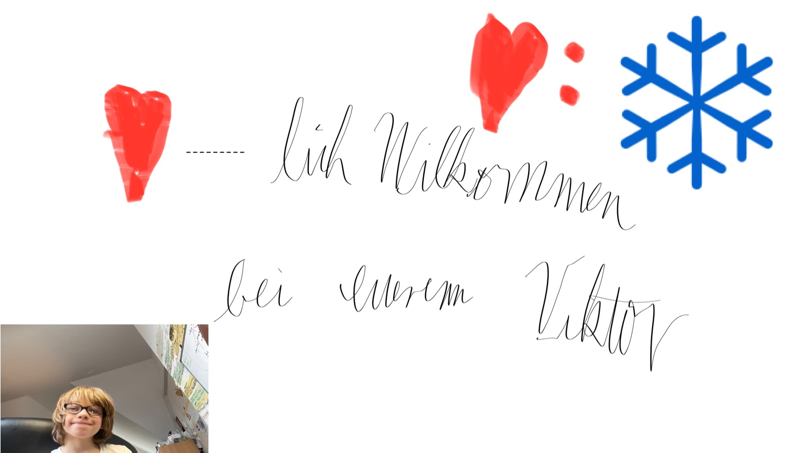
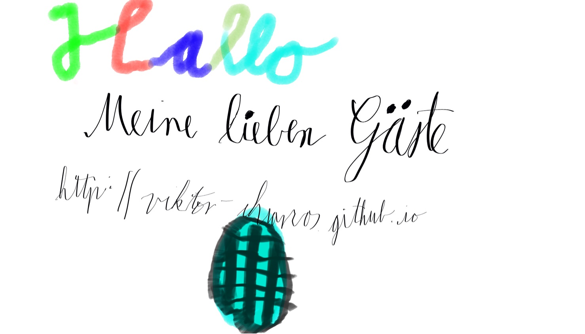

<!--
---
layout: home
permalink: /

title: "URL Viktor Chiarcos"

feature_rows:
  - title: "Über mich"
    excerpt: "Ich bin Viktor"
    url: "/about/"
    img_path: "Entwurf/VIKTOR-WEBBILD.jpg"
    img_alt: "..."
  - title: "Blog"
    excerpt: "List of recent blogs.."
    url: "/blog/"
    img_path: "Entwurf/VIKTOR-WEBBILD.jpg"
    img_alt: "Blog"
  - title: "Technik"
    excerpt: "Ich interessiere mich für Technik"
    url: "/tech/"
    img_path: "Entwurf/VIKTOR-WEBBILD.jpg"
    img_alt: "Technik"
 - title: "Eiskunstlauf"
    excerpt: "Ich bin Eiskunstläufer"
    url: "/ice/"
    img_path: "Entwurf/VIKTOR-WEBBILD.jpg"
    img_alt: "Eiskunstlauf"
- title: "Spiele mit Andre"
  excerpt: 
  url: "/games/"
  img_path: "Entwurf/VIKTOR-WEBBILD.jpg"
  img_alt: "Spiele"
  
    
---
-->
# Über die Webseite
## Webseite von Viktor | Stand 2.3.25
<iframe width="560" height="315" src="https://www.youtube.com/embed/jrbPJaX0QD0?si=fRTU95BTxhgYwSAG" title="Webseite von Viktor | Stand 2.3.25" frameborder="0" allow="accelerometer; autoplay; clipboard-write; encrypted-media; gyroscope; picture-in-picture; web-share" referrerpolicy="strict-origin-when-cross-origin" allowfullscreen></iframe>

<!-- 

-->

        

<!--

-->

        

<!--

-->

        

<!--

ist jetzt im Menü oben

# Sprache

- [включить Русский Язик](https://viktor--chiarcos-github-io.translate.goog/?_x_tr_sl=auto&_x_tr_tl=ru&_x_tr_hl=de&_x_tr_pto=wapp)
- [Power On English Language](https://viktor--chiarcos-github-io.translate.goog/?_x_tr_sl=auto&_x_tr_tl=en&_x_tr_hl=de&_x_tr_pto=wapp)
- [Deutsche Sprache Aktivieren](https://viktor--chiarcos-github-io.translate.goog/?_x_tr_sl=auto&_x_tr_tl=de&_x_tr_hl=de&_x_tr_pto=wapp)
- [Andere Sprachen verwenden](https://translate.google.com/?hl=de&sl=auto&tl=de&op=websites) (bitte geben sie da die Webseite: viktor-chiarcos.github.io ein)
- [404-Error Demonstration öffnen](http://viktor-chiarcos.github.io/404-error/demonstraion)

-->

- ## Software: ViktorOS 2.5

Das ist die aktuelle Version der Webseite ;)

- [Änderungen Vorschlagen und Vornehmen, Kommentare Senden und Webseite Bewerten](https://chat.whatsapp.com/CggRJX5SJn8FMcLwCfd8VJ)

&nbsp;

# Mich treffen

- [Bitte benachrichtigen (Bitte schreiben Sie die Nachricht: "Hallo ich bin ..., Ich will telefonieren und möchte folgende Möglichkeit verwenden")](https://chat.whatsapp.com/CggRJX5SJn8FMcLwCfd8VJ)
  - [Google(erste Möglichkeit))](https://meet.google.com/qdp-pqtz-fso)
  - [Yandex (Zweite Möglichkeit)](https://telemost.yandex.ru/j/48912595575715)

# Mitteilungen (Werden maximal 7 Tage Gelagert)
## [Aktivieren sie die Elektronische Benachrichtigungen](https://chat.whatsapp.com/L4rY65bQCVtIRQMpIIz06b)

- Der Viktor ChatBot ist jetzt verfügbar (2025-2-14)

<!--
&nbsp;

   Das ist noch eine Baustelle.

--

<!-- 
# Was hierher soll

#Website Wunsch 1 (this_well_me.md[Markdown_Dokument]) (Für meine Webseite)[<a href="http://viktor-chiarcos.github.io">http://viktor-chiarcos.github.io</a>]

Link zu [<a href="https://github.com/viktor-chiarcos">https://github.com/viktor-chiarcos</a>]

Editor für Text und BIld und Video Dateien

Audio Recorder [Bitte nur zu Download und nicht Öffentlich]

Presentationen erstellen [mit Presentation meine ich: Folien Erstellen mit Effekten verknüpfungen und Dateien]

Cloud Speicher (Bitte so viel Speicher wie möglich mindesten 2 TB)

Meeting Link [Bitte 5 Links erstellen, bever Peresonen beitreten sollen sie ihren Vornamen und Nachnamen Hinterlassen]

Einen Unterlink mit dem ich verschiedene Webseiten nach meiner Wahl öffnen Kann

Ein Webseitnlogo mit meiеm Bild

Ein Speicher Für Kontakte

   -->
