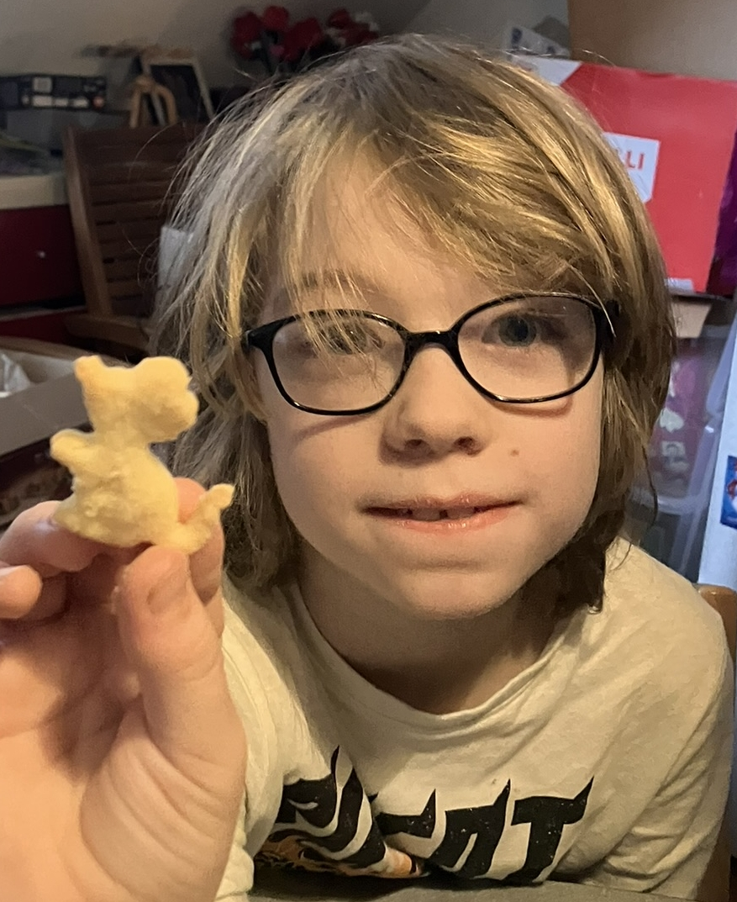

   [Über mich](about)

   Das ist noch eine Baustelle.

# Was hierher soll

#Website Wunsch 1 (this_well_me.md[Markdown_Dokument]) (Für meine Webseite)[<a href="http://viktor-chiarcos.github.io">http://viktor-chiarcos.github.io</a>]

Link zu [<a href="https://github.com/viktor-chiarcos">https://github.com/viktor-chiarcos</a>]

Editor für Text und BIld und Video Dateien

Audio Recorder [Bitte nur zu Download und nicht Öffentlich]

Presentationen erstellen [mit Presentation meine ich: Folien Erstellen mit Effekten verknüpfungen und Dateien]

Cloud Speicher (Bitte so viel Speicher wie möglich mindesten 2 TB)

Meeting Link [Bitte 5 Links erstellen, bever Peresonen beitreten sollen sie ihren Vornamen und Nachnamen Hinterlassen]

Einen Unterlink mit dem ich verschiedene Webseiten nach meiner Wahl öffnen Kann

Ein Webseitnlogo mit meiеm Bild

Ein Speicher Für Kontakte

   
